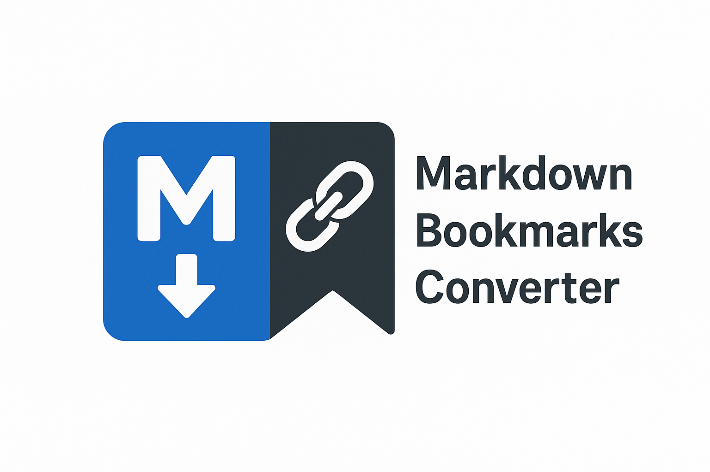
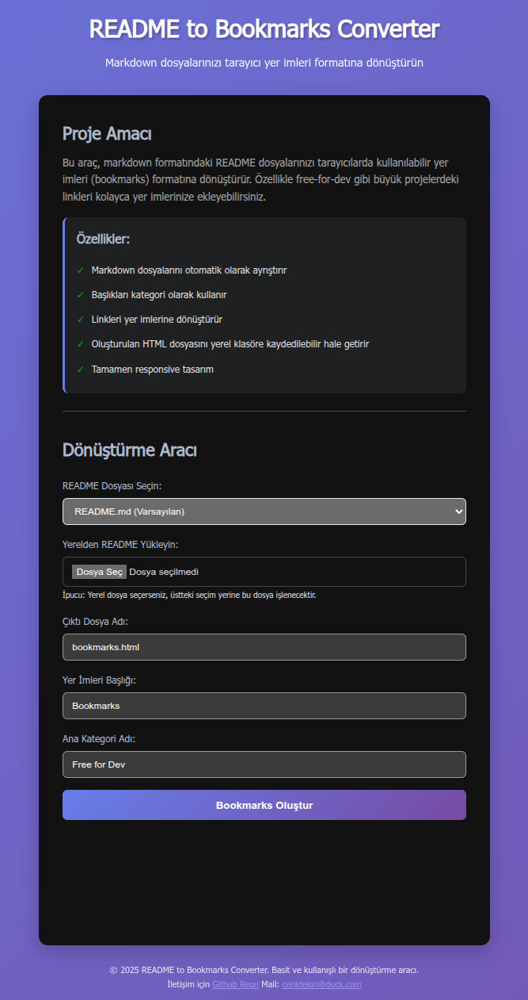

# Free for Dev Bookmarks Converter

<p align="center">
  
</p>

[](https://opensource.org/licenses/MIT)
[](https://www.python.org/)
[](https://developer.mozilla.org/)
[](https://github.com/cenktekin/markdown-bookmarks-converter/releases/latest)

Bu araç, [ripienaar/free-for-dev](https://github.com/ripienaar/free-for-dev) projesindeki gibi büyük README dosyalarını tarayıcı yer imleri (bookmarks) formatına dönüştürür.



## 🔗 Demo

Canlı demo (GitHub Pages):

https://cenktekin.github.io/markdown-bookmarks-converter/

## 🎯 Proje Amacı

Markdown formatındaki büyük README dosyalarını, özellikle ücretsiz geliştirici kaynakları listelerini, tarayıcılarda kolayca kullanılabilir yer imleri formatına dönüştürür. Bu sayede yüzlerce linki düzenli bir şekilde yer imlerinize ekleyebilirsiniz.

## ✨ Özellikler

- **Web Arayüzü**: Tarayıcı üzerinden kolayca kullanım
- **Otomatik Ayrıştırma**: Markdown başlıklarını kategori olarak işler
- **Link Çıkarma**: Markdown linklerini otomatik olarak yer imlerine dönüştürür
- **Netscape Formatı**: Standart tarayıcı yer imleri formatı (HTML)
- **Responsive Tasarım**: Mobil uyumlu web arayüzü
- **Türkçe Desteği**: Türkçe karakter ve dil desteği
- **Yerel Klasöre Kaydetme**: Chromium tabanlı tarayıcılarda çıktı dosyasını doğrudan klasöre kaydetme

> Not: Komut satırı ile dönüştürme için Python tabanlı yardımcı betikler `tools/` klasöründedir (opsiyonel).

## 🚀 Kurulum ve Kullanım

### (Opsiyonel) Python Betiği ile Kullanım

1. Betikler `tools/` klasöründe yer alır. Örnek kullanım:
```bash
python tools/convert_to_bookmarks.py -i README.md -o bookmarks.html -t "Bookmarks" -r "Free for Dev"
```

### Web Arayüzü ile Kullanım

1. Proje dosyalarını sunucuya veya yerel makinenize kopyalayın (ya da doğrudan demoyu kullanın: https://cenktekin.github.io/markdown-bookmarks-converter/)
2. `index.html` dosyasını tarayıcınızda açın
3. Kullanıcı arayüzünden README dosyasını seçin ve dönüştürmeyi başlatın
4. İşlem tamamlanınca "💾 Klasöre Kaydet (Yerel)" butonuna tıklayın

> Yerel klasöre kaydetme özelliği Chromium tabanlı tarayıcılarda (Chrome, Edge, Brave vb.) çalışır.

## 📁 Dosya Yapısı

```
markdown-bookmarks-converter/
├── README.md                    # Proje dokümantasyonu
├── index.html                   # Web arayüzü ana sayfası
├── script.js                    # Web arayüzü JavaScript kodu
├── style.css                    # Web arayüzü stilleri
├── image.png                    # README görseli
├── logo.webp                    # Proje logosu
├── samples/                     # Örnek çıktı dosyaları
│   ├── bookmarks-latest.html
│   ├── test_bookmarks.html
│   ├── test_bookmarks2.html
│   └── test_bookmarks_from_web.html
├── tests/                       # Test girdileri ve betikleri
│   ├── test_empty.md
│   ├── test_invalid_format.txt
│   ├── test_large.md
│   ├── test_readme.md
│   ├── test_special_chars.md
│   ├── browser_compatibility_test.js
│   ├── mobile_compatibility_test.js
│   ├── validate_output.js
│   ├── generate_large_test.js
│   └── test_web_interface.js
├── tools/                       # Yardımcı komut satırı betikleri
│   ├── convert_to_bookmarks.py
│   └── fetch_readme.py
└── logs/
    └── fetch_readme.log
```

## 🛠️ Teknik Detaylar

### Python Betiği

- **Girdi İşleme**: UTF-8 destekli markdown dosyası okuma
- **Ayrıştırma**: Regex ile başlık ve link çıkarma
- **Çıktı Formatı**: Netscape bookmarks standardı
- **Hata Yönetimi**: Kapsamlı hata yakalama ve loglama

### Web Arayüzü

- **Frontend**: Saf HTML, CSS ve JavaScript
- **Responsive**: Mobil, tablet ve masaüstü uyumlu
- **Progress Bar**: İşlem ilerlemesi göstergesi
- **Konsol Logları**: İşlem logları geliştirici konsolunda
- **Yerel Kaydetme**: Çıktıyı klasöre kaydetme (Chromium tabanlı tarayıcılarda)

### Test Dosyaları

- `test_readme.md`: Standart test verisi
- `test_bookmarks.html`: Çıktı formatı testi
- `test_invalid_format.txt`: Geçersiz format testi
- `test_empty.md`: Boş dosya testi
- `test_special_chars.md`: Özel karakter testi
- `test_large.md`: Büyük dosya performans testi

## 📋 Sistem Gereksinimleri

### Python Betiği
- Python 3.6+
- Standart kütüphaneler (argparse, logging, re, sys, datetime, html, pathlib, typing)

### Web Arayüzü
- Modern web tarayıcısı
- JavaScript etkin olmalı, UTF-8 desteği
- Yerel klasöre kaydetme için Chromium tabanlı bir tarayıcı (Chrome, Edge, Brave vb.)

## 🔧 Örnek Kullanım Senaryoları

### 1. Free for Dev Projesi
```bash
python convert_to_bookmarks.py -i free-for-dev/README.md -t "Free for Dev Bookmarks"
```

### 2. Özel README Dosyaları
```bash
python convert_to_bookmarks.py -i projem/README.md -o projem-bookmarks.html -r "Projem Linkleri"
```

### 3. Web Arayüzü ile
1. `index.html` dosyasını açın
2. "README Dosyası Seçin" menüsünden dosyayı seçin
3. Çıktı dosya adını ve başlığı belirleyin
4. "Bookmarks Oluştur" butonuna tıklayın
5. "💾 Klasöre Kaydet (Yerel)" ile kaydedin (Chromium)

## 📊 Çıktı Örneği

Oluşturulan HTML dosyası şu şekilde bir yapı içerir:

```html
<!DOCTYPE NETSCAPE-Bookmark-file-1>
<META HTTP-EQUIV="Content-Type" CONTENT="text/html; charset=UTF-8">
<TITLE>Bookmarks</TITLE>
<DL><p>
<DT><H3 ADD_DATE="..." LAST_MODIFIED="..." PERSONAL_TOOLBAR_FOLDER="true">Free for Dev</H3>
<DL><p>
    <DT><H3 ADD_DATE="..." LAST_MODIFIED="...">Major Cloud Providers</H3>
    <DL><p>
        <DT><A HREF="https://aws.amazon.com" ADD_DATE="...">Amazon Web Services</A>
        <DT><A HREF="https://azure.microsoft.com" ADD_DATE="...">Microsoft Azure</A>
        <!-- Diğer linkler -->
    </DL><p>
    <!-- Diğer kategoriler -->
</DL><p>
</DL><p>
```

## 🤝 Katkıda Bulunma

Katkılarınızı memnuniyetle karşılıyoruz! Lütfen aşağıdaki adımları izleyin:

1. Bu depoyu "fork"layın
2. Yeni bir özellik dalı oluşturun (`git checkout -b feature/yeni-ozellik`)
3. Değişikliklerinizi yapın ve commit edin (`git commit -am 'Yeni özellik eklendi'`)
4. Dalı itin (`git push origin feature/yeni-ozellik`)
5. Bir "Pull Request" oluşturun

## 📝 Lisans

Bu proje [MIT Lisansı](LICENSE) altında açık kaynaklıdır. Detaylar için [LICENSE](LICENSE) dosyasına bakın.

## 🔗 İlgili Linkler

- [ripienaar/free-for-dev](https://github.com/ripienaar/free-for-dev) - Orijinal kaynak
- [Netscape Bookmark Format](https://msdn.microsoft.com/en-us/library/ms775124(v=vs.85).aspx) - Bookmark formatı belgeleri
- [Markdown Syntax](https://www.markdownguide.org/basic-syntax/) - Markdown sözdizimi

## 📞 İletişim

Sorularınız, önerileriniz veya hata bildirimleri için:
- GitHub Issues üzerinden iletişime geçin
- E-posta: [cenktekin@duck.com](mailto:cenktekin@duck.com)

---

**Not**: Bu araç, [ripienaar/free-for-dev](https://github.com/ripienaar/free-for-dev) projesindeki gibi büyük kaynak listelerini yönetmek için geliştirilmiştir. Orijinal projeye saygı duyarak ve onun faydalı yapısını kullanarak bağımsız bir araç olarak sunulmuştur.